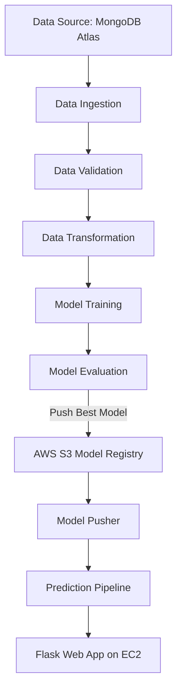

# 🚗 Vehicle Insurance ML Project

An **end-to-end Machine Learning project** that demonstrates **MLOps best practices**, from data ingestion to model deployment, powered by **MongoDB, AWS, Docker, GitHub Actions, and CI/CD pipelines**.

This project aims to show recruiters and developers a **production-ready ML workflow** that is modular, scalable, and cloud-native.

---

## 📌 Key Features

✅ **Project Setup & Package Management**

* Custom project structure generated using `template.py`.
* Local packages handled via **`setup.py`** and **`pyproject.toml`**.
* Environment setup using **Conda** + `requirements.txt`.

✅ **Database Integration**

* **MongoDB Atlas** used as the primary database.
* Dataset ingestion via Python notebooks into MongoDB.
* Data fetched as key-value and transformed into Pandas DataFrames.

✅ **Logging & Exception Handling**

* Centralized **logging module** for better debugging.
* Custom **exception handling module** tested with `demo.py`.

✅ **Data Pipeline Components**

* **Data Ingestion** → Pulls raw data from MongoDB.
* **Data Validation** → Schema-based checks with `schema.yaml`.
* **Data Transformation** → Feature engineering & preprocessing.
* **Model Training** → ML model building & evaluation.
* **Model Evaluation** → Monitors model drift.
* **Model Pusher** → Pushes model to AWS S3 registry.

✅ **Cloud & AWS Services**

* **IAM** setup for secure AWS access.
* **S3 Bucket** for model storage & registry.
* Model versioning with threshold-based evaluation.

✅ **CI/CD Pipeline**

* **Dockerized application** with `Dockerfile` & `.dockerignore`.
* **GitHub Actions Workflow** for automation.
* **ECR (Elastic Container Registry)** for image storage.
* **EC2 Deployment** with self-hosted GitHub runner.

✅ **Web Application**

* Flask-based `app.py` with REST endpoints.
* `/train` → Trigger model training.
* `/predict` → Make predictions.
* Hosted on **EC2 public IP + port 5000**.

---

## 🛠️ Tech Stack

* **Languages:** Python 3.10
* **ML Libraries:** Pandas, Scikit-learn, NumPy
* **Database:** MongoDB Atlas
* **Cloud:** AWS (IAM, S3, EC2, ECR)
* **CI/CD:** GitHub Actions, Docker
* **Orchestration:** Modular ML pipeline with configuration-driven design
* **Logging & Monitoring:** Custom Python logging + exception handling

---

## ⚙️ Project Workflow



---

## 🚀 Setup & Installation

### 1️⃣ Clone Repository

```bash
git clone <repo_url>
cd Vehicle-Insurance-ML
```

### 2️⃣ Setup Environment

```bash
conda create -n vehicle python=3.10 -y
conda activate vehicle
pip install -r requirements.txt
```

### 3️⃣ MongoDB Setup

* Create free cluster on [MongoDB Atlas](https://www.mongodb.com/cloud/atlas).
* Setup **network access** → `0.0.0.0/0`.
* Copy **connection string** & save as `MONGODB_URL` environment variable.

```bash
# Linux / Mac
export MONGODB_URL="mongodb+srv://<username>:<password>@cluster-url"

# Windows PowerShell
$env:MONGODB_URL="mongodb+srv://<username>:<password>@cluster-url"
```

### 4️⃣ Run Demo

```bash
python demo.py
```

---

## ☁️ AWS Deployment

* **IAM User** with `AdministratorAccess`.
* **S3 Bucket** for model registry.
* **ECR Repo** for Docker images`.
* **EC2 Instance** (Ubuntu 24.04, T2 Medium).

### GitHub Actions Secrets:

* `AWS_ACCESS_KEY_ID`
* `AWS_SECRET_ACCESS_KEY`
* `AWS_DEFAULT_REGION`
* `ECR_REPO`

---

## 🖥️ CI/CD Pipeline

1. Code pushed to GitHub → Triggers workflow.
2. GitHub Action builds Docker image → Pushes to **AWS ECR**.
3. EC2 Self-Hosted Runner pulls latest image.
4. Flask app hosted on **EC2 Public IP:5000**.

---

## 📂 Project Structure

```
Vehicle-Insurance-ML/
│── src/
│   ├── components/           # Data ingestion, validation, transformation, trainer
│   ├── configuration/        # MongoDB, AWS, schema, pipeline configs
│   ├── entity/               # Entities: config, artifact, estimator
│   ├── pipeline/             # Training & prediction pipelines
│   ├── utils/                # Helper utilities
│   └── logger, exception     # Logging & error handling
│
│── notebook/                 # EDA, MongoDB data push
│── static/, template/        # Flask web app UI
│── requirements.txt
│── setup.py
│── pyproject.toml
│── Dockerfile
│── .github/workflows/aws.yaml
│── app.py
│── demo.py
```

---

## 🌟 Highlight

This project is not just a **machine learning model**, it is a **complete MLOps workflow** demonstrating:

* How to move from **data ingestion** → **model training** → **deployment**.
* How to use **cloud-native CI/CD pipelines** for automation.
* How to serve ML predictions through a **production-ready web app**.

---